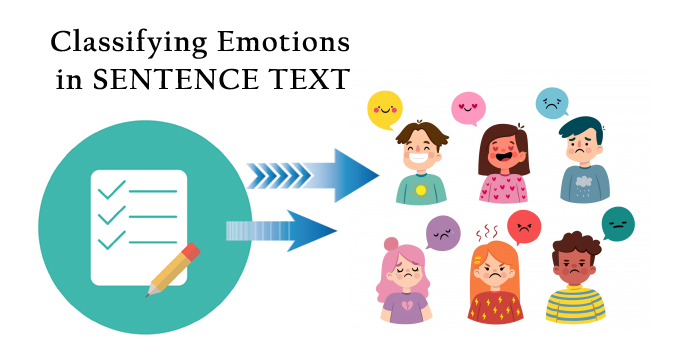

---

# 😃 Text-Emotion-Classification using Natural Language Processing



# 🚀 Live Application

🔗 **[Access the Web Application](https://sam-text-emotion.streamlit.app/)** — Try it live to see emotion predictions from your own text inputs in real-time.

---

# 📌 Project Overview

The **Text-Emotion-Classification** project is an interactive machine learning application designed to detect emotions from written text using **Natural Language Processing (NLP)** techniques. It leverages a trained model to classify user input into categories such as *joy*, *anger*, *fear*, *sadness*, and more.

Developed using **Python**, the backend is powered by **Scikit-learn** and **NLTK**, and the frontend is rendered using **Streamlit**, offering a clean and responsive UI.

This tool can be used in:

* Social media sentiment analysis
* Chatbots and customer support automation
* Mental health monitoring
* Academic research on language and emotions

---

# 🛠️ Tech Stack & Tools Used

| Category      | Tools & Libraries           |
| ------------- | --------------------------- |
| Language      | Python 3.8+                 |
| UI Framework  | Streamlit                   |
| ML Libraries  | Scikit-learn, Joblib        |
| NLP Tools     | NLTK                 |
| Data Analysis | Pandas, NumPy               |
| Visualization | Matplotlib, Seaborn, Altair |
| Environment   | venv (Virtual Environment)  |
| IDE           | VS Code (Recommended)       |

---

# 📦 Features

✅ Emotion classification using ML model trained on labeled text  
✅ Easy-to-use input field for real-time emotion prediction  
✅ Dynamic visualization of emotion label distributions  
✅ Organized notebooks for training and testing models  
✅ Modular architecture (separate folders for model, datasets, notebooks)  
✅ Ready for deployment on **Streamlit Cloud**, **Heroku**, or **Docker**  

---

# 📁 File Structure

```
.
├── Dataset/
│   ├── Emotion Dataset.csv          # Raw labeled emotion dataset
│   ├── training_dataset.csv         # Preprocessed training set
│   └── testing_dataset.csv          # Preprocessed testing set
│
├── Model/
│   └── Text-Model.joblib            # Trained classifier model
│
├── Notebooks/
│   ├── Training Notebook.ipynb      # Model training workflow
│   └── Testing Notebook.ipynb       # Model evaluation
│
├── Assets/
│   └── Text.jpg                          # Additional image resource
│
├── app.py                           # Streamlit app
├── requirements.txt                 # Python dependencies
├── .gitignore                       # Ignored files/folders
├── LICENSE                          # MIT License
└── README.md                        # Project documentation

```

---

# 📊 Emotion Categories

Depending on the dataset, the model may classify text into one or more of the following emotions:

* 😄 Joy
* 😡 Anger
* 😢 Sadness
* 😨 Fear
* 😲 Surprise
* 😐 Neutral
* 😍 Love

---

# ⚙️ Local Setup Instructions

Follow these steps to run the project locally:

## 1. Clone the Repository

```bash
git clone https://github.com/Samarth-Kumar-Samal/Emotion-Text-Classification-using-NLP.git
cd Emotion-Text-Classification-using-NLP
```

## 2. Create a Python Virtual Environment

```bash
python -m venv venv
```

## 3. Activate the Environment

* **Windows:**

```bash
venv\Scripts\activate
```

* **Linux/Mac:**

```bash
source venv/bin/activate
```

## 4. Install Required Packages

```bash
pip install -r requirements.txt
```

## 5. Run the Application

```bash
streamlit run app.py
```

Streamlit will launch your default browser with the app running locally.

---

# 🧪 Model Training & Evaluation

* Use `Training Notebook.ipynb` to:

  * Load and preprocess text data
  * Tokenize and vectorize using `CountVectorizer` or `TfidfVectorizer`
  * Train a classifier (e.g., Logistic Regression, SVM)
  * Save the trained model using `joblib`

* Use `Testing Notebook.ipynb` to:

  * Load the trained model
  * Evaluate accuracy, precision, recall, F1-score
  * Visualize confusion matrix and classification report

---

# 🧰 Deployment (Optional)

To deploy the app online:

## Using Streamlit Cloud:

* Push code to a public GitHub repo
* Go to [Streamlit Cloud](https://streamlit.io/cloud)
* Connect the repo and deploy — it's free and easy!

## Using Docker:

* Build the image:

  ```bash
  docker build -t emotion-nlp-app .
  ```
* Run the container:

  ```bash
  docker run -p 8501:8501 emotion-nlp-app
  ```

---

# 🙌 Contributing

We welcome contributions!

1. Fork this repository
2. Create your branch: `git checkout -b feature-name`
3. Commit your changes: `git commit -m "Add feature"`
4. Push to the branch: `git push origin feature-name`
5. Open a pull request 🚀

---

# 📜 License

Licensed under the **MIT License** – see the [LICENSE](./LICENSE) file for details.

---

# 👤 Author

**Samarth Kumar Samal**
🔗 [GitHub Profile](https://github.com/Samarth-Kumar-Samal)

---

# 🙏 Acknowledgements

A big thanks to the open-source libraries and tools that made this possible:

* [NumPy](https://numpy.org/)
* [Pandas](https://pandas.pydata.org/)
* [Matplotlib](https://matplotlib.org/)
* [Seaborn](https://seaborn.pydata.org/)
* [Scikit-learn](https://scikit-learn.org/)
* [NLTK](https://www.nltk.org/)
* [Streamlit](https://streamlit.io/)
* [Altair](https://altair-viz.github.io/)

---
